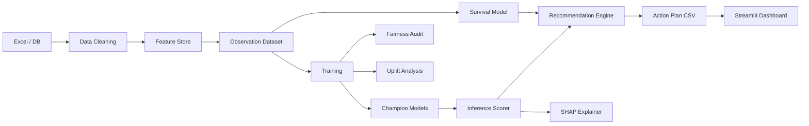

# Production System Architecture

## Directory Structure

```
blood-donor-retention-prediction/
├── config/
│   └── pipeline.yaml              # Central configuration
├── data/
│   └── Samarpan_BloodBank_SyntheticDataset_V2.xlsx
├── research/                      # Scientific audit & literature reports
├── feature_store/
│   ├── builders.py                # Enhanced RFMTC+ feature engineering
│   └── artifacts/                 # Parquet observation datasets
├── training/
│   ├── survival.py                # Cox PH + Kaplan-Meier
│   ├── uplift.py                  # T-learner + causal recommendations
│   └── fairness.py                # Bias auditing
├── models/                        # (outputs/models) Serialized pipelines
├── inference/
│   ├── scorer.py                  # Production scoring API
│   └── explainer.py               # Local SHAP narratives
├── recommendation_engine/
│   └── engine.py                  # Rules + uplift merge
├── dashboard/
│   └── streamlit_app.py           # Executive / Donor / Operations views
├── tests/
│   └── test_pipeline.py
├── src/                           # Core library (legacy + shared)
├── scripts/
│   ├── run_pipeline.py            # Legacy pipeline
│   └── run_production_pipeline.py # v2 orchestrator
└── outputs/
    ├── figures/
    ├── metrics/
    └── models/
```

## Data Flow



## Component Responsibilities

| Component | Input | Output | SLA |
|-----------|-------|--------|-----|
| Feature Store | Raw tables | Parquet observations | Batch daily |
| Training | Features + labels | joblib models + metrics | Weekly / on drift |
| Inference | Latest donor state | P(retain), P(churn) | <100ms/donor |
| Recommendation | Scores + rules | Single intervention | Real-time |
| Dashboard | CSV/Parquet | BI views | On-demand |

## Model Versioning

- Artifacts: `outputs/models/{target}_{model}.joblib`
- Metrics: `outputs/metrics/{target}_{model}.json`
- Summary: `outputs/metrics/pipeline_summary_v2.json`
- **Production upgrade path:** MLflow or DVC registry

## Monitoring

| Signal | Threshold | Action |
|--------|-----------|--------|
| PSI on scores | > 0.20 | Alert + investigate |
| ROC-AUC drop | > 0.05 | Retrain |
| Brier degradation | > 0.03 | Recalibrate |
| Fairness gap | > 0.10 | Mitigation review |

## Security & Compliance

- PII hashing before SMS gateway transmission (DPDP Act)
- No gender-based exclusion — gender used only for deferral-aware messaging
- Synthetic data watermark in all reports
